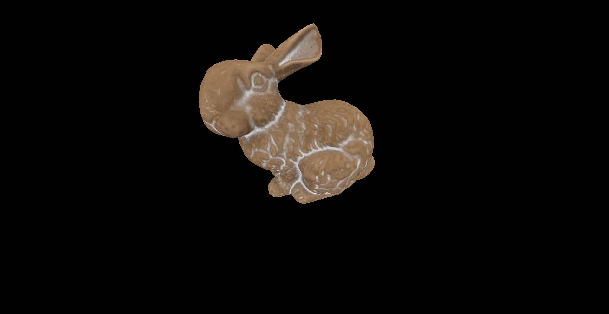
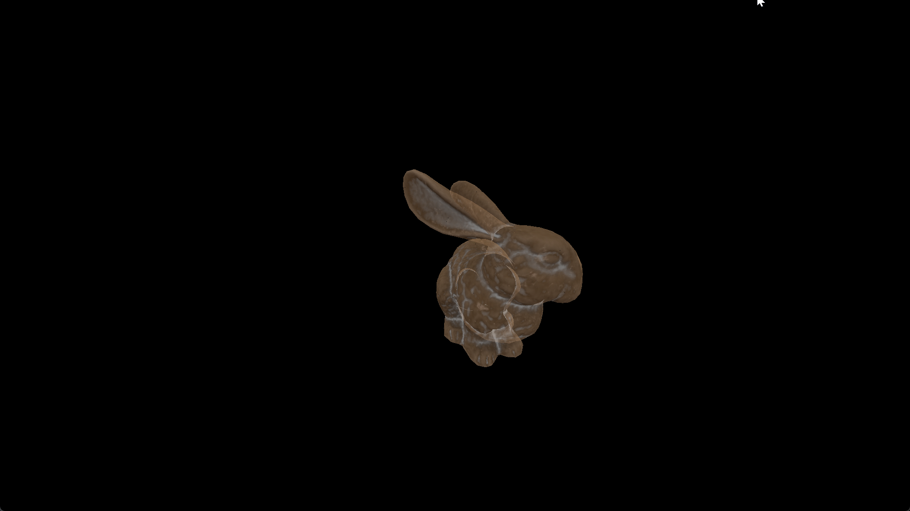
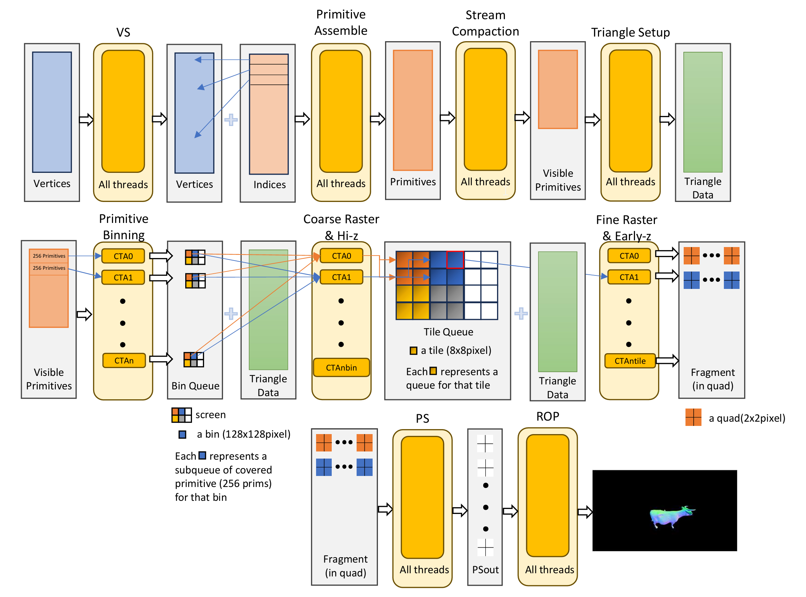
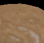
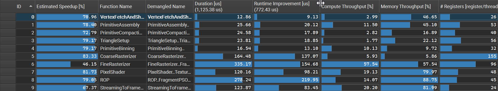
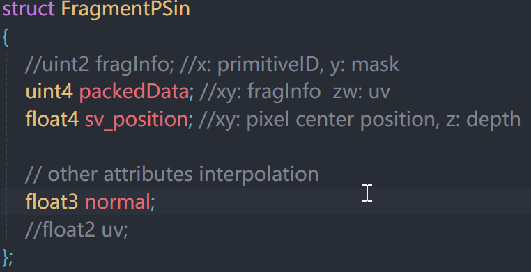
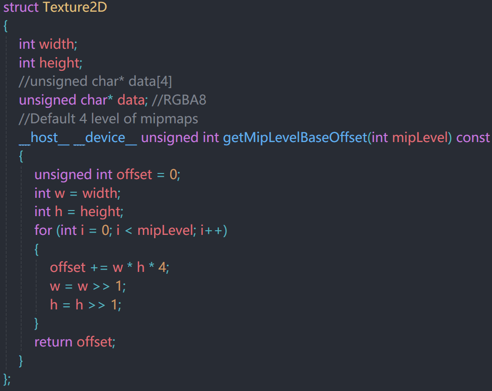
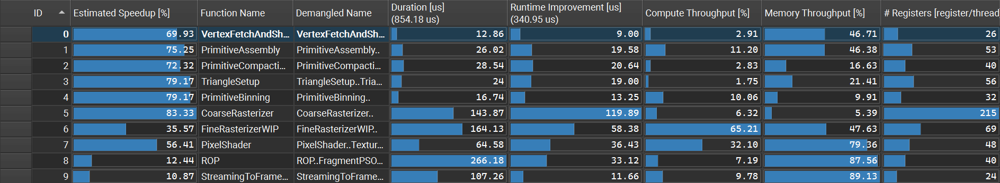
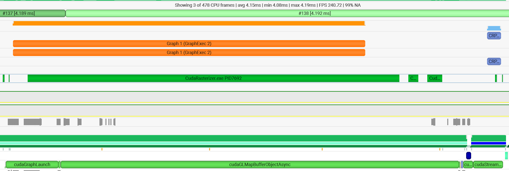
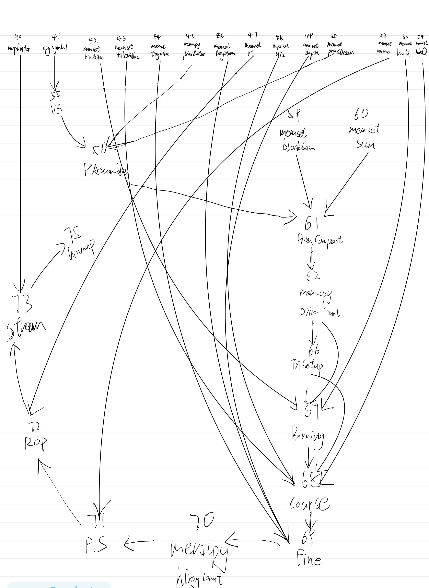

# CUDA Rasterizer

**Hangyu Zhang**

A high-performance GPU rasterizer implemented entirely in CUDA, simulating modern hardware pipeline and features (Nvidia's tiled caching rendering pipeline)

---

*Stanford Bunny rendered at 1920x1080 with texture mapping and trilinear filtering*

*upper - opaque; bottom - OIT*

### Motivation - Why Build a CUDA Rasterizer?

Traditional graphics APIs (OpenGL, DirectX, Vulkan) abstract away the rendering pipeline. This project peels back those layers to implement every stage manually on the GPU, providing deep insight into:
- How modern GPUs organize rendering work into tiles for better cache efficiency
- Memory access patterns and atomics for lock-free data structures
- Parallel primitive processing and stream compaction
- CUDA-OpenGL interop for zero-copy buffer sharing
- Performance optimization through CUDA Graphs

## Pipeline Architecture

### Work flow

| Stage | Kernel | Description |
|-------|--------|-------------|
| **1** | `VertexFetchAndShading` | Transform vertices to clip space (MVP matrix) |
| **2** | `PrimitiveAssembly` | Generate triangles, frustum clipping, backface culling |
| **3** | `PrimitiveCompaction` | Stream compact to remove culled primitives |
| **4** | `TriangleSetup` | Compute edge equations, depth equations, AABBs, interpolation coefficients |
| **5** | `PrimitiveBinning` | Assign triangles to 128x128 screen bins |
| **6** | `CoarseRasterizer` | Subdivide bins into 8x8 pixel tiles & compute tile cover and hierarchical z |
| **7** | `FineRasterizerWIP` | Generate fragments in 2x2 quads for derivatives & compute pixel coverage for fragment in quad and early-z |
| **8** | `PixelShader` | per fragment shading |
| **9** | `ROP` | Depth test, blending, write to render target (preserve API order) |

## Key Features

### Modern Tile-based Rendering Architecture

We implemented a sort-middle rendering architecture (the primitives are redistributed by binning), which is similar to Nvidia's Tile caching immediate mode rendering(TCR) after Maxwell architecture and AMD's Draw stream binning rasterization (DSBR).

(Since we cannot get the real implementation of both their architectures, I have to make some self experiment to guess their structure. We introduced a binning process and assigns each GPC(block) with a big tile on the screen. I believe it's more like DSBR - in contrast TCR assigns GPC with a set of small tiles in one big tile with a checkboard pattern)

- **Two-Level Tiling System beyond Fine Raster**: Screen divided into 128x128 pixel bins, a chunk of triangles will first test coverage with each bin on the screen. Further the bins are subdivided into 8x8 pixel tiles, testing triangle-tile intersection before queuing work for fine rasterization.. This system helps us balance the workload among different SMs and reduce the amount of fine rasterization.
- **Complicated Z-test System**: We use a hi-z to test if a triangle is fully occluded by other in a coarse level and early-z to test if a fragment should pass into the PS stage. This strategy further reduces the overhead of fine rasterization and the amount of overdraw for pixel shader.
- **Quad-based Pixel shader**: In fine rasterization, we output each fragment in a quad form (with 3 adjacent fragments). And parallelly process 8 quads in one warp for PS.
- **Restrict API Order and OIT**: In order to make fragment write order obey primitive sequence, we do a caching and sorting for all fragments write to each pixel. The sort based on primitive ID and be replaced with depth in order to implemented a OIT. 

As the figure above shows, because of the task reducing and redistributing system of the tile-based arch, it's smooth to both zoom in and out

### Advanced CUDA Primitives & technique [See Chapter Optimization & Performance Analysis]

* Use **warp level functions** implemented a high performance block Size scan algorithm
* Use **cooperative groups** implemented a one pass stream paction which allows compaction up to **500,000** primitives
* Efficient usage of shared mem and atomic operation
  * reduce atomic allocation operations by one block/warp issue one (minimize stall counts)
  * change per thread atomic access to shared mem (minimize stall cycles) 
* Use **persistent threading** to reduce thread **divergence** and **unbalance** work load in a block

### Advanced Texturing

- **Trilinear Filtering** with automatic LOD calculation (based on quad info)
- CPU-side mipmap generation
- **DDX/DDY derivative** computation using warp shuffle operations
- an optimized **tile linear storage** structure for texture

 

left side: sampling with bilinear interpolation, right side: sampling with trilinear interpolation

with trilinear interpolation, we get a less noisy texture (blurred) which dramatically increase rendering quality for objects at distance

### CUDA Multi-Stream & Graph Optimization [See Chapter Optimization & Performance Analysis]

- use cudaStream & cudaGraph to capture a "pipeline object" for the rasterizer and reuse it every frame
- reducing overhead of launch small kernels in the pipeline 
- leverage the parallel capability of different GPU tasks (copy & kernel) and between CPU and GPU (async copy & launch)

## Optimization & Performance Analysis

### Test Scene
- **Model**: Stanford Bunny (5000 triangles) Cow (5000 triangles)

  **As the cooperative group's limitation on launched kernel block size, currently we cannot process model have more than 10k triangles. So we test our pipeline with model about 5000 triangles

- **Resolution**: 1920x1080

### Kernel Performance

**Baseline Performance (tiled base method without optimizing)**

As shown in the figure, the goal of optimization should focus on kernels "CoarseRasterizer", "FineRasterizer", "PixelShader", "ROP", and "StreamingToFrameBuffer" as they take much of the frame time.

   
Optimization: CoarseRasterizer
      As it has a small kernel size (a block for one bin), reducing register usage here makes no sense. Hence we increase the loop unrolling count, increasing instruction effectiveness.   

Optimization: FineRasterizer
 
    We rewrite the queue read logic and fragment write back logic, making global read and write amortized among the warp, reducing warp divergence. Interestingly, by making every 4 threads write a quad back, we increase memory coalescing and reduce the register overhead of loop unrolling, which also increases occupancy. Besides that, we increase our block size from 32 to 256, let every 32 threads (a warp) process one tile and the whole block process 4 tiles simultaneously. This dramatically increases occupancy, hiding read latency and eliminating the tail effect.

 
    
Optimization: PixelShader
    

    We optimize the fragment data structure, allowing each thread of the warp to read and write continuous 16-byte (float4) data in global mem. Secondly, as kernel arguments have to load to register from constant cache, when the parameter is large, the register may spill into local memory, which introduces memory stalls when accessing. We optimize the Texture2D structure and method to read from texture.
     
    
    
     
    The figure above shows our optimized data structure, see source code for more details

 
    
Optimization: ROP Stage

    For the same reason, we packed the structure for FragmentOut. Besides that, we use shared mem to eliminate local memory usage and reduce register usage, which makes the kernel's ideal occupancy reach 100%. 
    <mark>But, unfortunately, increasing the occupancy lets more blocks stay alive on SM, which may lead to more eviction for cachelines, making L1 & L2 hit rate lower.
    </mark> 
        So, we do not see big improvements for this kernel. 

 
    
Optimization: StreamingToFrameBuffer
As it has a memory-bound nature, what we do is just making memory access coalescing.

With these optimization, we get a 31.7% improvement on performance:

**Final Performance**

### CUDA Graph Impact

**Default Stream Performance**

With all CUDA API calls (memset, memcpy, kernel...) on default stream (implicit synchronized), we can not leverage on the parallel power of GPU hardware and between CPU and GPU. As shown in the above figure, the GPU can process only one call at a time, and CPU have to wait for synchronizing to execute the next CUDA API. Besides, because our pipeline has several small task (~ 30us), the overhead of kernel launch dominated. Both of the factors cause a lower GPU busy rate during each frame. 

   
Optimization: CUDA Graph
  
	First, instead of copy back from GPU to decide next kernel launch size, we launch fixed size block for each kernl, which not only eliminates costly device-to-host mem copy but enables the reuse of cuda graph each frame as well.
 
	Second, for inevitable host-to-device mem copy every frame (constants and buffer initialization), we use pinned memory and memcpyasync to make it fit into our cuda graph execution.
 
	We built a dependency graph for all tasks and uses different stream to process independent tasks with event record for stream joint.
 
	
  dependency graph structure illustration

**Rewrite With Multi Stream & CudaGraph**

**Performance analysis**:

| Metric | Default Stream | CUDA Graph | Improvement |
|--------|--------------|------------|-------------|
| CPU Time | 7.79ms         | 4.2ms | +85.48% |
| GPU Time | 6.14ms         | 4.07ms | +50.85%     |
| GPU Time for Rasterize Pipeline | 6.02ms         | 2.81ms | +114.23%    |
| Total Frame Time | 7.79ms | 4.2ms      | +85.48% |

With cuda graph, we see a dramatical improvement over frame rate (from 120 to 240). As the graph implementation optimizes the rendering pipeline by:

* Capturing the entire frame workload as a reusable graph
* Eliminating kernel launch overhead
* Enabling concurrent execution of independent operations

## Limitation & Failure Case

**holes on model**

In release mode, there are some one pixel size holes on model. Since it's in release mode, we cannot use CUDA debugging to see what happened there. Just some speculation, it may caused by the precision of depth value - we store z-plane equation in float form and convert float depth to unsigned depth by multiply a large float, which can cause data precision problems when execute on different SMs at different time. 

the cursor points out some holes on the bunny model when rendering in pure color.

**cuda graph limit**

OpenGL interop (`cudaGraphicsMapResources`) cannot be captured in graphs. So we have to write map and unmap logic out of the graph every frame. As these task takes a lot time cpu time whiling keep gpu spare, the GPU still have a stall overhead waiting driver complete resouce mapping

**kernel limit**

* CUDA kernel cannot directly use the L2 cache from last kernel. So all buffers have to write back to global mem and then fetch by other kernels, which requires more bandwidth than real hardware pipeline.
* Cooperative group' have a limitation on launched kernel block size, which makes our stream compaction cannot reach the theoretical maximum.

## Future Enhancements

**Render target compression**: use 4:1 & 8:1 DCC for color and depth buffer, further reduce memory bandwidth for early/late-z and fragment write back 

**Compressed Textures**: similar to rt compression, reduce bandwidth

**Cuda Graph Caching**: like pipeline object caching, support rasterization with different settings and reduce overhead for capture new graph

## References

- [Real-Time Rendering, Fourth Edition, Chapter 23](https://www.realtimerendering.com/)
- [A trip through the Graphics Pipeline](https://fgiesen.wordpress.com/2011/07/09/a-trip-through-the-graphics-pipeline-2011-index/)
- [tiled caching rendering](https://www.realworldtech.com/tile-based-rasterization-nvidia-gpus/)
- [High-Performance Software Rasterization on GPUs](https://research.nvidia.com/sites/default/files/pubs/2011-08_High-Performance-Software-Rasterization/laine2011hpg_paper.pdf)
- S. Molnar, M. Cox, D. Ellsworth and H. Fuchs, "A sorting classification of parallel rendering," in *IEEE Computer Graphics and Applications*, vol. 14, no. 4, pp. 23-32, July 1994, doi: 10.1109/38.291528. keywords: {Sorting;Geometry;Concurrent computing;Computational efficiency;Hardware;Feedforward systems;Pipelines;Aggregates;Costs;Application software},
